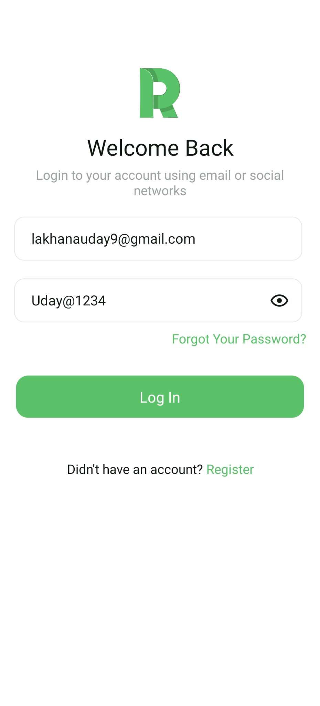
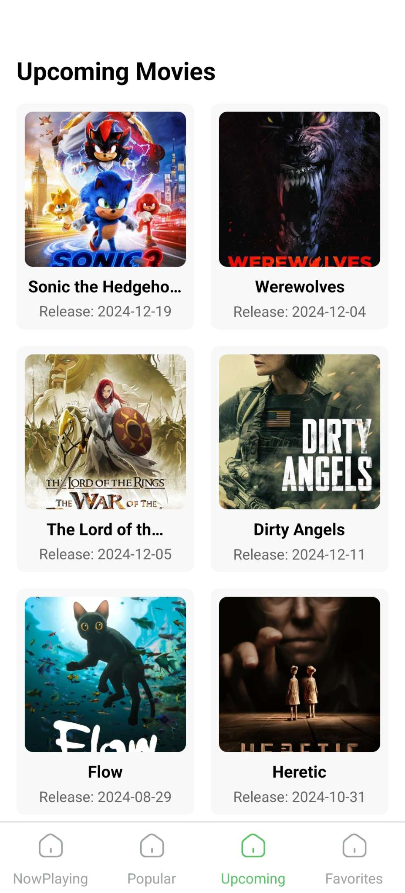

# React Native Movie App

## Project Description
The React Native Movie App is a simple project that allows users to list their movie preferences. Users can select the movie categories they want and view corresponding movie recommendations based on their selections.

## Features
- **Firebase Authentication**:
  - User registration with fields for First Name, Last Name, Email, Password (with confirm password), Address, and Profile Picture (from camera/gallery).
  - Secure login functionality using email and password.
  - Password validation and error handling.

- **Dynamic Movie Lists**:
  - Tabs for Now Playing, Popular, and Upcoming movies.
  - Fetch and display movie posters, titles, and brief details from the TMDb API.

- **Favorites Management**:
  - Add/remove movies to/from a favorites list stored in Firebase Firestore.
  - Toggle favorite status with a visual icon.

- **Profile Management**:
  - Upload and store user profile data and images in Firebase Firestore and Storage.

- **Navigation**:
  - Tabbed navigation using react-navigation and react-native-tab-view.

## Setup Instructions

### Steps to Clone the Repository
1. Clone the repository:
   ```bash
   git clone https://github.com/UGlakhana45/PracticleUday.git
   ```
2. Navigate to the project directory:
   ```bash
   cd PracticleUday
   ```

### Requirements for Running the Project

- **React Native Environment**:
  - Follow the [React Native Environment Setup](https://reactnative.dev/docs/environment-setup) guide for your system.

- **Dependencies**:
  - Install project dependencies:
    ```bash
    npm install
    ```

- **Firebase Setup**:
  1. Create a Firebase project at [Firebase Console](https://console.firebase.google.com/).
  2. Enable Email/Password Authentication in the Firebase Authentication section.
  3. Create a Firestore database and configure rules.
  4. Set up Firebase Storage for profile picture uploads.
  5. Download and add the `google-services.json` (for Android) and `GoogleService-Info.plist` (for iOS) to the respective platforms in your project.

### Running the Project
1. Start the Metro bundler:
   ```bash
   npm start
   ```
2. Run the app:
   - **For Android**:
     ```bash
     npx react-native run-android or npm run android
     ```
   - **For iOS**:
     ```bash
    npx react-native run-android or npm run ios 
     ```

## Usage

- **Login and Registration**:
  1. Register using the app with the required details.
  2. Login using your email and password.

- **Browsing Movies**:
  - Navigate through the Now Playing, Popular, and Upcoming tabs to explore movies.

- **Favorites Management**:
  - Add movies to your favorites by clicking the favorite icon on a movie detail screen.
  - View your favorite movies in the Favorites tab.

## Tech Stack

- **Frontend**:
  - React Native
  - React Navigation

- **Backend**:
  - Firebase Authentication
  - Firebase Firestore
  - Firebase Storage
  
- **API**:
  - TMDb API

## Screenshots
1. Login Screen


2. Registration Screen


3. Home Screen (Now Playing, Popular, Upcoming)




4. Movie Details Screen


5. Favorites Screen


6. Profile screen firebase limitation.


---
